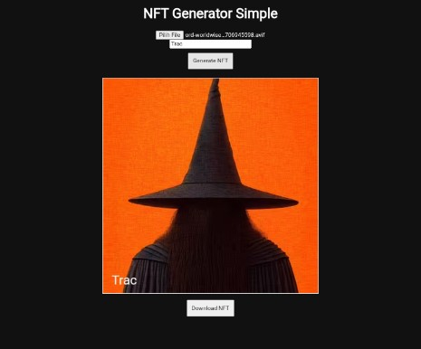

# 🚀 NFT Generator

> A Modern Web-Based NFT Generator   
> Lightweight • Responsive • No Backend Required

---

## ✨ Overview

NFT Generator is a modern web application built using HTML5 Canvas and Vanilla JavaScript that allows users to generate custom NFTs directly in the browser.

This project is lightweight, fast, and runs entirely on the client side — making it perfect for:

- NFT design testing
- Web3 prototypes
- Creative digital experiments
- Portfolio showcase
- Educational purposes

No backend. No database. No external dependencies.

---

## 🖼 Preview

---

## 🔥 Core Features

✔ Modern Glassmorphism UI  
✔ Gradient Background Design  
✔ Fully Responsive (Mobile Friendly)  
✔ Upload Local Image  
✔ Add Custom NFT Name  
✔ Canvas-Based Rendering  
✔ Instant PNG Download  
✔ 100% Client-Side Processing  
✔ No Server Required  

---

## 🧠 How It Works

The application uses:

- HTML5 Canvas API
- Vanilla JavaScript
- CSS3 Modern UI Design

All image processing and rendering happen directly in the user's browser.

Nothing is stored or sent to a server.

---

## 📦 Installation (Using Termux)

### 1️⃣ Update Packages

pkg update && pkg upgrade -y

2️⃣ Install NodeJS

pkg install nodejs -y

3️⃣ Install HTTP Server

npm install -g http-server

4️⃣ Run the Project
Navigate to the project folder and run:

http-server

Then open your browser and visit:

http://127.0.0.1:8080

📂 Project Structure

nft-generator-pro/
│
├── index.html
├── README.md
└── preview.png

🛠 Customization
•You can easily modify:
•Canvas size
•Font style
•Text colors
•Background gradient
•UI styling
•All configurations are inside index.html

TRAC ADDRESS: trac124qeyenqzqepxf407mllvwluwj6fqd3vxjq9q0hjgy8ykhn67xvqtp896g
